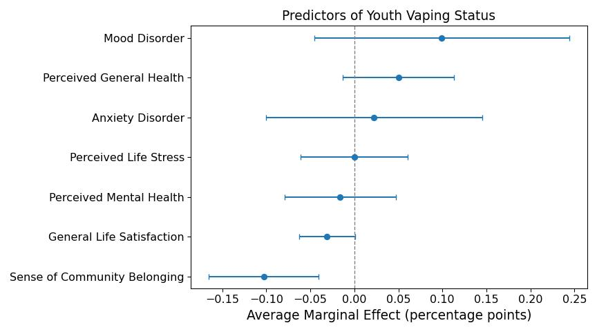

## Summary

- Youth's sense of belonging in their community was shown to meaningfully predict reductions in the likelihood of self-reported e-cigarette use.

- To a lesser extent, general life satisfaction also reduced the likelihood that youth used e-cigarettes.

- Other variables like perceived mental health, perceived stress, and presence of an anxiety or mood disorder did not significantly change the predicted probability of e-cigarette use.

- Policy focused on reducing youth vaping may consider enhancing youth community engagement and targeting overall life satisfaction. Other factors not included here should also be explored. 

## Introduction

Research has explored the factors associated with high vaping prevalence in Canada [@millerCanadaHasHighest2023]. Alcohol and cannabis use, or recent school absences correlate with daily e-cigarette use [@shiMachineLearningApproach2022]. How might data reflecting the psychological well-being of youth respondents influence their likelihood to vape? This project explores several variables that may change the probability that a young person has recently used an e-cigarette.

## Data Description

This project uses data from the [Canadian Community Health Survey: Public Use Microdata File](https://doi.org/10.25318/82m0013x-eng). The data are from the 2022 report, and are based on reports from over 130,000 people across Canada age 12+. This project included data from 447 youth respondents. 

## Methodology

Only data from youth respondents (aged 12–17) were analyzed. The binary outcome variable was whether a youth respondent had used an e-cigarette at least once over the past month. The two classes were reasonably balanced (55% non-users, 45% users). Several continuous and binary variables were investigated to explore their influence on the probability of the outcome. For a concise presentation of these predictor variables, refer to the left side of *Figure 1*.

The youth sample was queried from the full microdata file using SQL, via the `duckdb` library. Subsequent cleaning, modelling, and visualization was done in Python. The complete analysis code can be viewed as an HTML file [here](https://github.com/cartermsmith/predictors-youth-vaping).

## Findings

To examine what influences youth vaping, a logistic regression was first implemented. This analysis revealed that each time a young person's self-reported sense of community belonging increases by one point, the likelihood that they have recently used an e-cigarette is reduced by 10.3 percentage points. Further, when general life satisfaction is increased by one unit, this likelihood decreases by 3.1 percentage points, although this finding was marginal (see *Figure 1*).

None of the other predictors meaningfully changed the outcome variable.

## Conclusion

The likelihood for youth to use e-cigarettes within the past month is reduced by 10.3 percentage points when their sense of belonging is heightened. Further, general life satisfaction seems to slightly reduce vaping likelihood, by 3.1 percentage points.

## Limitations

Only two predictors meaningfully altered the likelihood of e-cigarette use. One explanation was that the predictors were highly correlated, violating a key assumption of logistic regression. After examining the variance inflation factor of each predictor, many of the variables were closely correlated with each other. A random forest classifier, which does not make this assumption, allowed me to examine predictor importance.

However, upon checking the diagnostics of the model, I found that this model did not learn much from the data. The model was only doing slightly better than random guessing when making predictions (AUC = 0.52). This means that any conclusions drawn from this model's predictor rankings should be interpreted cautiously.

Therefore, I concluded that the lacking effects in the logistic model were driven by few signals in a noisy dataset, rather than a statistical assumption being violated. 

The significant predictors in the logistic model remain as strong signals that may guide programs that aim to reduce youth vaping by targeting certain measures of well-being like community belonging or life satisfaction.